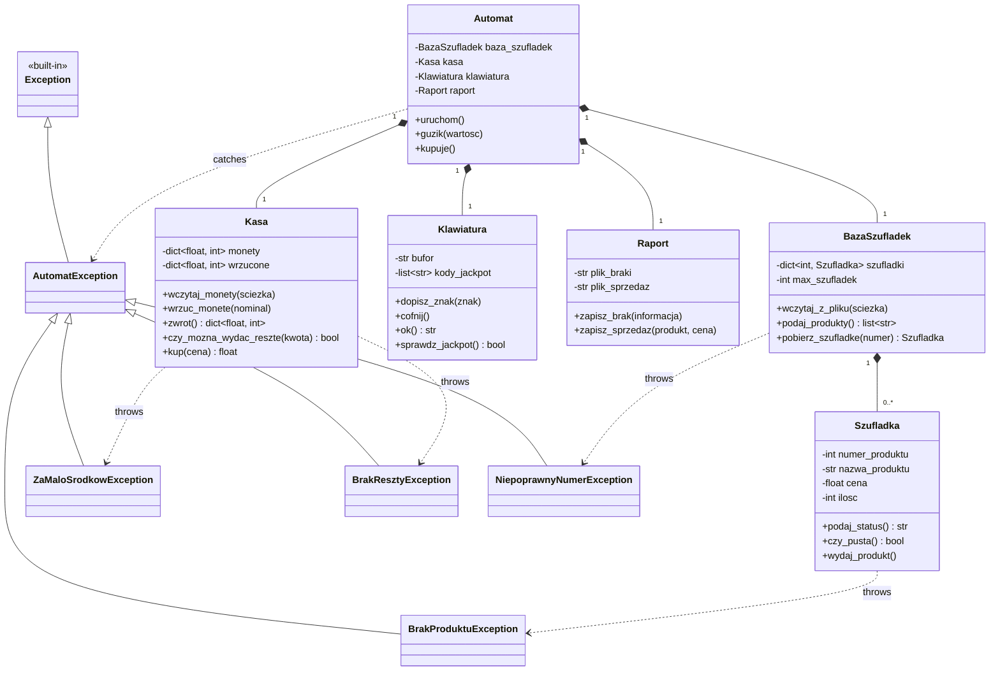

```mermaid
classDiagram
    class Automat {
        -BazaSzufladek baza_szufladek
        -Kasa kasa
        -Klawiatura klawiatura
        -Raport raport
        +uruchom()
        +guzik(wartosc)
        +kupuje()
    }

    class BazaSzufladek {
        -dict~int, Szufladka~ szufladki
        -int max_szufladek
        +wczytaj_z_pliku(sciezka)
        +podaj_produkty() list~str~
        +pobierz_szufladke(numer) Szufladka
    }

    class Szufladka {
        -int numer_produktu
        -str nazwa_produktu
        -float cena
        -int ilosc
        +podaj_status() str
        +czy_pusta() bool
        +wydaj_produkt()
    }

    class Kasa {
        -dict~float, int~ monety
        -dict~float, int~ wrzucone
        +wczytaj_monety(sciezka)
        +wrzuc_monete(nominal)
        +zwrot() dict~float, int~
        +czy_mozna_wydac_reszte(kwota) bool
        +kup(cena) float
    }

    class Klawiatura {
        -str bufor
        -list~str~ kody_jackpot
        +dopisz_znak(znak)
        +cofnij()
        +ok() str
        +sprawdz_jackpot() bool
    }

    class Raport {
        -str plik_braki
        -str plik_sprzedaz
        +zapisz_brak(informacja)
        +zapisz_sprzedaz(produkt, cena)
    }

    class Exception {
        <<built-in>>
    }
    class AutomatException
    class ZaMaloSrodkowException
    class BrakProduktuException
    class BrakResztyException
    class NiepoprawnyNumerException

    Automat "1" *-- "1" BazaSzufladek
    Automat "1" *-- "1" Kasa
    Automat "1" *-- "1" Klawiatura
    Automat "1" *-- "1" Raport
    BazaSzufladek "1" *-- "0..*" Szufladka

    Exception <|-- AutomatException
    AutomatException <|-- ZaMaloSrodkowException
    AutomatException <|-- BrakProduktuException
    AutomatException <|-- BrakResztyException
    AutomatException <|-- NiepoprawnyNumerException

    Szufladka ..> BrakProduktuException : throws
    BazaSzufladek ..> NiepoprawnyNumerException : throws
    Kasa ..> ZaMaloSrodkowException : throws
    Kasa ..> BrakResztyException : throws
    Automat ..> AutomatException : catches
```
